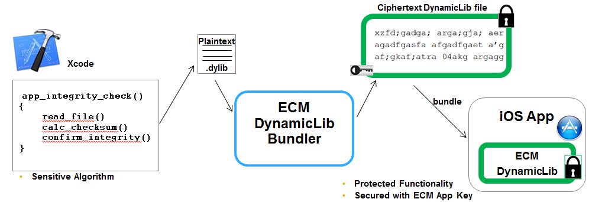

# iMAS Encrypted Code Modules 

## Background

The "iMAS Encrypted Code Modules" security control mitigates static attacks - allows section of source code to be encrypted into a .dylib at build time and decrypted at run-time.  It protects the code against static analysis and forces an attacker to perform a dynamic attack.  When used in concert with other iMAS security controls, ECMs will raise an applications security significantly.

## Vulnerabilities Addressed
1. Binary patching can lead to dangerous function being added and invoked
  - CWE-676: Use of Potentially Dangerous Function
  - CWE-494: Download of Code Without Integrity Check

## Summary
  - iOS Static App attacks are very common
  - Code injection and binary patching can compromise app
  - Application Integrity is critical to thwarting these techniques
  - Implementing App Integrity is difficult
  - iMAS introduces ECM

# Diagram

Below is a diagram showing the components for ECM

## Installation
Download code, compile ECM Demo App last.  Connect xcode to a iOS7 device and run.  
- git pull encrypted_code_modules
- Make sure that each project is putting derived data relative to the project.  This can be accomplished in XCode by going to *File->Project Settings...* and selecting "Project-relative" from the dropdown. 
- Verify that an executable is set for ECM Build for the demo.  To do do this go to *Product->Scheme->Edit Scheme..* select *Run imas_ecm_demo* from the left panel, and then *imas_ecm_demo_app.app* in the Executable drop-down.
- Compile the ECM Demo App last.  Make sure to use the *ECM Build* target.
- Ensure XCode scheme is set to ECM Demo App > < device only >
- Clean, run and explore

## License

Copyright 2014 The MITRE Corporation, All Rights Reserved.

Licensed under the Apache License, Version 2.0 (the "License");
you may not use this work except in compliance with the License.
You may obtain a copy of the License at

    http://www.apache.org/licenses/LICENSE-2.0

Unless required by applicable law or agreed to in writing, software
distributed under the License is distributed on an "AS IS" BASIS,
WITHOUT WARRANTIES OR CONDITIONS OF ANY KIND, either express or implied.
See the License for the specific language governing permissions and
limitations under the License.
